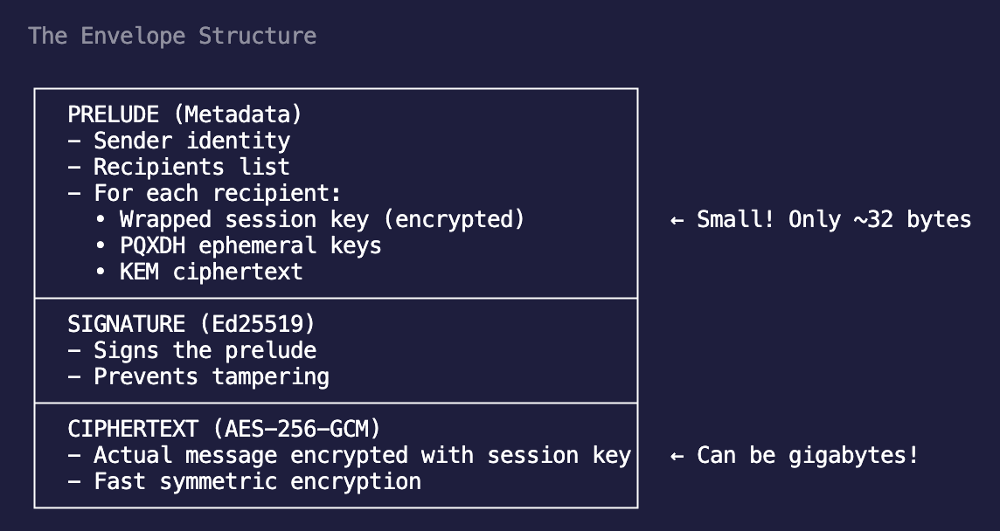

# SYC2 Envelope Format

This document describes the “SYC2” envelope implemented inside the CLI. The JSON sample below still shows placeholder values for readability, but production builds populate those fields with the actual Syft crypto data.

---

## High-Level Goals

- Detect encrypted assets by peeking at a fixed header (`SYC2`) instead of relying on file extensions.
- Carry signer and recipient metadata in a canonical JSON prelude so tooling (`syc file inspect`) can expose context without touching ciphertext.
- Allow signature verification prior to decryption and support optional payload integrity checks.
- Prevent the need for sidecar files which ensures atomicity when dealing with each file
- Allow for future format / version changes

---

## File Layout

```
┌─────────────┬────────┬──────────────┬─────────────────────┬──────────────┬────────────┐
│ MAGIC(4B)   │ VERSION│ PRELUDE LEN  │ PRELUDE (padded 4K) │ SIG LEN (2B) │ SIGNATURE  │
└─────────────┴────────┴──────────────┴─────────────────────┴──────────────┴────────────┘
                                                                             │
                                                                             ▼
                                                                       CIPHERTEXT STREAM
```

The header is binary. If you dump the file as UTF‑8 you may see odd characters such as `}` right after `SYC2`. That’s simply the little-endian representation of the prelude length (`0x7D` = 125) and signature length (`0x1D` = 29) landing on printable ASCII. Use `hexdump -C` to inspect the structure; you’ll see the magic (`53 59 43 32`), version byte, 4-byte prelude length, canonical JSON prelude (padded to 4 KiB), 2-byte signature length, the detached signature, and finally the ciphertext.

1. **Magic + Version**
   - Magic: ASCII `SYC2`.
   - Version: single byte (`1` for the current version).
2. **Prelude Length**
   - Unsigned 32-bit little-endian integer describing the canonical JSON prelude length (in bytes).
3. **Prelude**
   - RFC 8785 canonical JSON describing signer, recipients, wrapping metadata, cipher info, and optional integrity/public metadata.
   - We use canonical JSON so that there can't be errors in slight changes with the json with different libraries / formatting rules leading to different hashes
   - Padded up to the next 4 KiB boundary with zeros to remain predictable.
4. **Signature Length**
   - Unsigned 16-bit little-endian integer describing the length of the detached signature.
5. **Signature**
   - Signature bytes. Currently this is a deterministic placeholder.
6. **Ciphertext**
   - Remainder of the file: the encrypted payload emitted by the Syft file cipher.



---

## Cipher Suites and the Ciphertext Stream

The bytes after the signature are described by the prelude's `cipher` section. Two suites exist;
both use the same key agreement, key wrapping, signing, and header, and differ only in how the
payload is sealed.

### `xchacha20poly1305-v1` (whole payload)

One XChaCha20-Poly1305 call over the entire plaintext with a random 24-byte nonce
(`cipher.nonce`, base64url) and AAD `syc-file-v1`. `segment_count` is always `1` and
`last_segment_bytes == ciphertext_len`. This is what `encrypt_message` produces and it requires
the whole payload in memory on both sides.

### `xchacha20poly1305-stream-v1` (segmented)

The plaintext is split into fixed-size segments (default 1 MiB, at most 256 MiB) and each
segment is sealed separately, so a payload of any size can be encrypted and decrypted with one
segment of memory. This is what `encrypt_stream` produces; `decrypt_stream` opens it with
bounded memory and `decrypt_message` opens it from memory.

```
┌──────────────────┬──────────────────┬─────┬──────────────────────────┐
│ segment 0 + tag  │ segment 1 + tag  │ ... │ last segment + tag (flag)│
└──────────────────┴──────────────────┴─────┴──────────────────────────┘
```

- `cipher.nonce` holds a random **19-byte** prefix (base64url).
- The nonce of segment `i` is `prefix || i (u32, big-endian) || last`, where `last` is `1`
  only for the final segment. AAD is `syc-stream-v1 || i (u32, big-endian) || last`.
- Every segment carries its own 16-byte Poly1305 tag.
- `segment_count`, `last_segment_bytes` (ciphertext bytes of the final segment, tag included)
  and `ciphertext_len` describe the geometry; the segment size is derived from them, so no new
  prelude field was introduced and older tooling can still parse and inspect the header.
- An empty payload is one empty segment (16 bytes of ciphertext).

Because the index and the terminal flag are bound into both the nonce and the AAD, a segment
that is moved, duplicated, dropped, or truncated fails authentication, and nothing may follow the
flagged final segment. The prelude that fixes the geometry is signed, so it cannot be altered to
match a manipulated stream. This is the STREAM construction (Hoang, Reyhanitabar, Rogaway, and
Vizár), as also used by `age`.

The plaintext length must be known before encryption starts because the signed prelude records
the segment geometry. `encrypt_stream` refuses a reader that yields fewer or more bytes than
declared.

Readers that predate this suite reject it with an invalid-format error rather than misreading it.

---

## Prelude Schema

```jsonc
{
	"version": 1,
	"canon": "jcs-rfc8785",
	"created_at": 1730338793,
	"sender": {
		"identity": "alice@example.org",
		"ik_fingerprint": "sha256hex...",
	},
	"recipients": [
		{
			"identity": "bob@example.org",
			"device_label": "default",
			"spk_fingerprint": "sha256hex...",
			"signed_prekey_id": 1,
		},
	],
	"recipient_set_fpr": "sha256hex...",
	"wrappings": [
		{
			"recipient_identity": "bob@example.org",
			"device_label": "default",
			"wrap_ephemeral_public": "base64url(x25519)",
			"wrap_ciphertext": "base64url(wrapped_key)",
		},
	],
	"cipher": {
		"suite": "xchacha20poly1305-v1",
		"segment_count": 1,           // >1 for the streaming suite
		"last_segment_bytes": 1234,   // ciphertext bytes of the final segment (tag included)
		"ciphertext_len": 1234,
		"nonce": "base64urlnonce",
	},
	"integrity": null,
	"public_meta": {
		"filename_hint": "optional_hint.txt",
	},
}
```

Fields correspond to Syft terminology:

- `sender.identity` / `sender.ik_fingerprint` describe the author (later derived from the Ed25519 identity key).
- Each entry in `recipients` mirrors a device binding: signed prekey fingerprint and the signed prekey ID.
- `wrappings` contain X3DH outputs: sender’s ephemeral public key and the wrapped file key for each target device.
- `cipher` names the suite and the segment geometry so `inspect` can report segment sizes without decryption (see *Cipher Suites and the Ciphertext Stream*).
- `integrity` will eventually hold a base64url SHA-256 hash of the ciphertext for tamper detection.
- `public_meta` carries small hints (e.g., `filename_hint`) that do not compromise confidentiality.

The JSON is produced via the RFC 8785 canonicalisation helper (`to_jcs_bytes`), ensuring deterministic hashing/signing.

---

## Signing Strategy

- `build_stub_envelope` and `verify_stub_signature` remain in the protocol crate purely as **test helpers** so parsing/unit tests can generate deterministic fixtures without invoking the full crypto stack.
